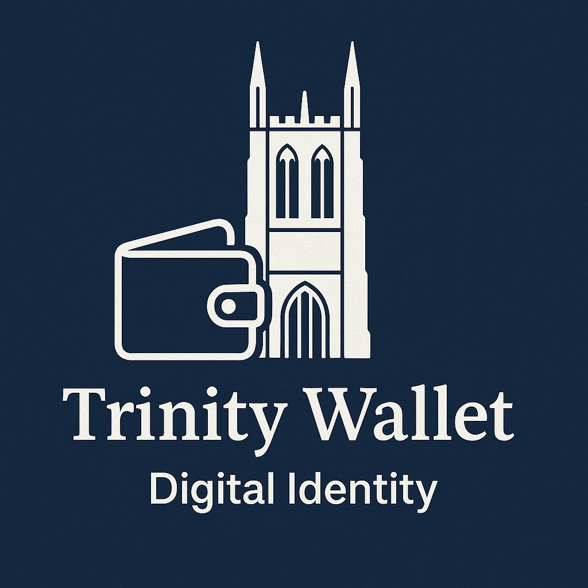

# Trinity Wallet - eIDAS 2.0 Compliant Digital Identity Wallet

Trinity Wallet is an eIDAS 2.0 compliant digital identity wallet designed for Trinity College students. It leverages Microsoft Azure for authentication, OpenID4VCI for credential issuance, OpenID4VP for credential presentation, and encrypted SQLite (SQLCipher) for on-device storage. BLE capabilities are integrated to unlock smart locks, and ECDSA-based signing allows for secure digital signatures. **It serves as a robust blueprint for building digital identity wallets compliant with eIDAS 2.0 standards.**

---

## 🚀 **Features**

* **Microsoft Azure Authentication**: Secure login using Trinity College credentials.
* **6-Digit PIN & Face ID**: Access controlled with bcrypt-hashed PIN and biometric authentication.
* **Credential Management**:

  * Request credentials from the [eIDAS Expert Group Issuer](https://issuer.eudiw.dev/) using OpenID4VCI.
  * Securely store credentials in an encrypted SQLite database.
  * View and delete credentials with a clean UI.
* **Credential Presentation**:

  * Present credentials to the [eIDAS Expert Group Verifier](https://verifier.eudiw.dev/home) using OpenID4VP.
  * Request and present Trinity-specific library credentials through:

    * [TrinityWalletServer](https://github.com/mbirnhak/TrinityWalletServer)
    * [TrinityLibraryVerifier](https://github.com/mbirnhak/TrinityLibraryVerifier)
* **Activity Logs**: Real-time logging for recent activity.
* **Smart Lock Integration**:

  * BLE-based unlocking for KUCACCI T17 smart lock.
  * Demo app available [here](https://github.com/mbirnhak/DemoLock).
* **Digital Signatures**:

  * Self-sign and embed digital (and handwritten) signatures into PDF documents using ECDSA.
* **Profile Customization**:

  * Upload profile picture, set display name, and manage personal information.
* **Home Dashboard**:

  * Quick access to logout, profile updates, and app details.

---

## 🔧 **Installation**

1. Clone the repository:

   ```bash
   git clone https://github.com/mbirnhak/TrinityWallet.git
   cd TrinityWallet
   ```

2. Install dependencies:

   ```bash
   npm install
   ```

3. Prebuild the app:

   ```bash
   npx expo prebuild
   ```

4. Start the app:

   ```bash
   npx expo start
   ```

5. Open in:

   * Android Emulator
   * iOS Simulator
   * Expo Go (for mobile testing)

---

## 🔐 **Backup & Restoration (Upcoming)**

* Planned implementation:

  * Secure database storage in Microsoft Azure.
  * Shamir Secret Sharing for decryption key distribution.

---

## 📡 **Endpoints Used**

* **eIDAS Issuer**: [https://issuer.eudiw.dev/](https://issuer.eudiw.dev/)
* **eIDAS Verifier**: [https://verifier.eudiw.dev/home](https://verifier.eudiw.dev/home)
* **Trinity College Issuer**: [TrinityWalletServer](https://github.com/mbirnhak/TrinityWalletServer)
* **Trinity College Verifier**: [TrinityLibraryVerifier](https://github.com/mbirnhak/TrinityLibraryVerifier)

---

## 📱 **Demo & Assets**

<a href="./TrinityWalletDemo.mp4">
  
</a>

Click the image to watch the demo video.
* **App Logo**: `TrinityWalletLogo.png`
* **Demo Video**: `TrinityWalletDemo.mp4`

Located in the root directory of the repository.

---

## 👥 **Contributors**

* Matthew Birnhak - [mbirnhak](https://github.com/mbirnhak)

---

## 📫 **Contact**

For inquiries, reach out:

* GitHub Issues: [TrinityWallet Issues](https://github.com/mbirnhak/TrinityWallet/issues)

---

## 🔄 **Contributing**

Submit a Pull Request or open an issue for enhancements or bug fixes. Contributions are welcome!

---

## 🎓 **Learn More**

* [OpenID4VCI Documentation](https://openid.net/connect/)
* [SQLCipher Documentation](https://www.zetetic.net/sqlcipher/)
* [BLE and Smart Lock SDK](https://github.com/mbirnhak/DemoLock)

Happy Building! 🚀